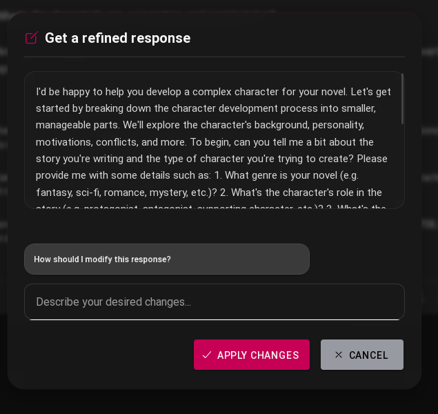
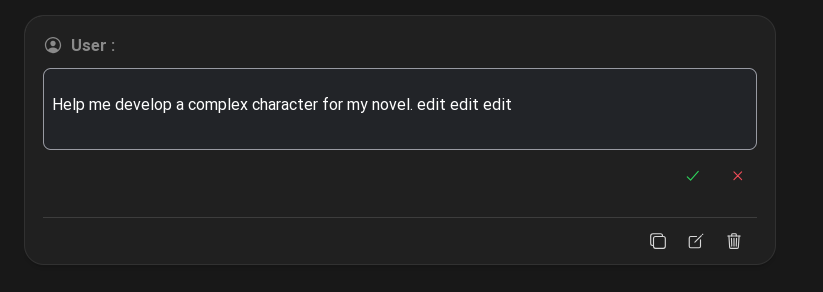
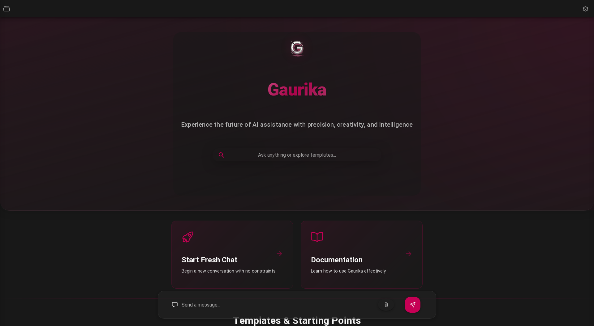
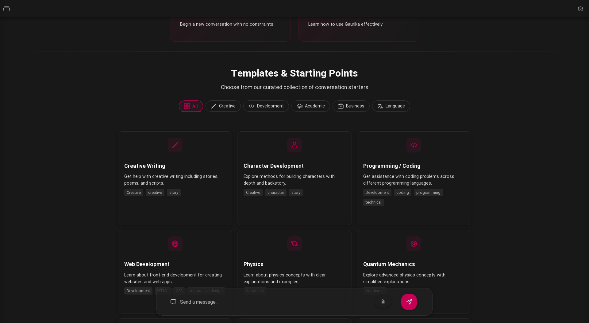

# Gaurika - The User Guide

## Introduction

Gaurika is an open-source project designed to allow users to plug in their own API keys and a base URL compatible with the OpenAI SDK. However, for the time being, you can use Gaurika for free without any requirements, powered by the llama3.1-70b model provided by Cerebras.

> In short, you can use Gaurika for free right now, but if you prefer, you can use your own API keys and base URL.

## Features

1) **Redo/Regenerate**

   The **Redo/Regenerate** feature lets you request a new response from the assistant if you're not satisfied with the current one.

   **How to Use:**

   - Click on the **Regenerate** button next to the assistant's message.
   - The assistant will generate a new response based on your last input.

   

2) **Refine**

   The **Refine** feature allows you to specify how you'd like the assistant to modify its previous response for better accuracy or detail.

   **How to Use:**

   - Click on the **Refine** button next to the assistant's message.
   - Provide instructions on how you'd like the response to be improved.
   - The assistant will update the response according to your instructions.

   

   

3) **Message Deletion**

   This feature enables you to delete any message in the conversation, whether it's yours or the assistant's.

   **How to Use:**

   - Click on the **Delete** icon next to the message you wish to remove.
   - Confirm the deletion when prompted.

   

   

4) **Edit Messages**

   You can edit your own messages after sending them using the **Edit Messages** feature.

   **How to Use:**

   - Click on the **Edit** icon next to your message.
   - Modify the text as needed.
   - Save the changes to update the message.

   

   

5) **Code Blocks**

   When the assistant provides code snippets, they are displayed in formatted code blocks for easy reading and copying.

   **How to Use:**

   - View the code in the formatted block within the assistant's response.
   - Click on the **Copy** button to copy the code to your clipboard.

   

6) **Template Section**

   The **Template Section** offers a variety of predefined conversation starters across different categories.

   **How to Use:**

   - From the home screen, browse through the available templates.
   - Use the search bar to find a template by keyword.
   - Click on a template to start a new conversation based on it.

   

   

   

7) **Personalized Learning**

   Gaurika can personalize responses by learning from your interactions.

   **How to Use:**

   - Enable **Personalized Learning** in the settings menu.
   - The assistant will adapt to your preferences over time.

   

8) **Web Search** *(WORKING ON IT)*

   *Feature under development.*

   The **Web Search** feature will allow the assistant to retrieve real-time information from the internet to provide up-to-date answers.

9) **Image Creation** *(WORKING ON IT)*

   *Feature under development.*

   The **Image Creation** feature will enable the assistant to generate images based on your descriptions or prompts.

10) **Voice Communication** *(WORKING ON IT)*

    *Feature under development.*

    The **Voice Communication** feature will allow you to interact with the assistant using voice commands and receive spoken responses.

11) **Multimodal Support** *(Not applicable unless you use your own API keys)*

    With **Multimodal Support**, the assistant can process and generate multiple types of data, such as text and images.

    **How to Use:**

    - Provide your own API keys and configure the base URL in the advanced settings.
    - Once set up, the assistant can handle multimodal inputs and outputs.

# TODO

- [ ] Complete the development of the **Web Search** feature.
- [ ] Implement the **Image Creation** feature.
- [ ] Enable **Voice Communication** capabilities.
- [ ] Update the documentation with new features as they become available.